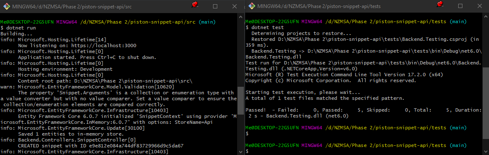

# Piston Snippet API

This is a REST API for storing and executing code snippets.

Snippets will be executed using the [Piston](https://github.com/engineer-man/piston) engine.

## Install

```bash
git clone https://github.com/apteryxxyz/piston-snippet-api.git
cd piston-snippet-api
```

## Run

```bash
cd src && dotnet run
```

Once running, you will be able to go to https://localhost:3000/swagger/index.html
and view the API documentation.

Starting in development mode will cause the API to debug log to the console.
These logs will include snippet IDs and API keys. 

## Test

Use the following commands to test the API while it is running. It covers the
all snippet endpoints.

> Note: Ensure the program is running on port 3000 before testing.

```bash
cd tests && dotnet test
```

Tests utilise the [NUnit](https://www.nunit.org/) testing framework.
Each test is a different method that will test the endpoints of the API,
in order.


